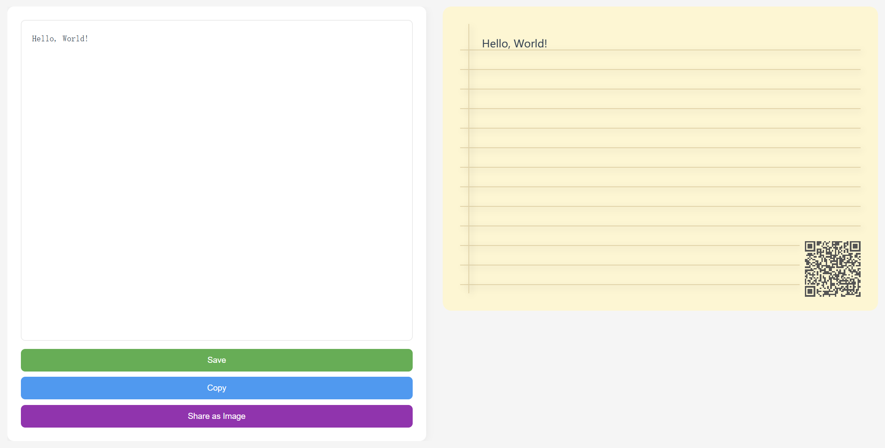

# NoteGo

NoteGo 是一个简单轻量的笔记应用，使用Go和Gin框架开发。

## 效果预览

访问 https://note.yffjglcms.com 预览效果。



## 主要特性

- 📝 简洁的编辑界面
- 💾 本地数据存储
- ⚡ 轻量级运行
- 🔒 安全可靠

## 技术栈

- 后端: Go + Gin
- 前端: HTML + CSS + JavaScript
- 数据存储: 本地文件系统 leveldb


## 运行

要运行这个应用程序,您需要安装Go和Gin框架。您可以使用以下命令安装依赖:

```
go mod tidy
```

然后,将上面的代码保存为一个Go文件(例如 `main.go`),并在终端中运行:

```
go run main.go
```

应用程序会监听 `http://localhost:8080/` 端点。您可以打开浏览器访问该地址,尝试输入文本并失去焦点来触发保存。


如果您有任何其他需求或疑问,欢迎随时告诉我。